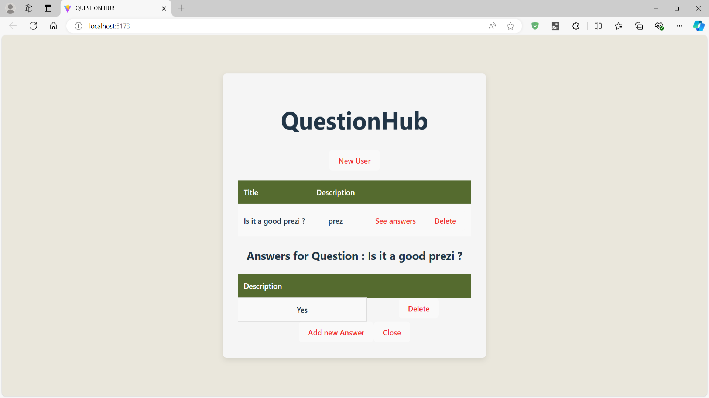

# AskMateOOP Project

;

## Overview
AskMateOOP is a web application for posting questions and answers, featuring user account creation. Currently, it is at a rudimentary level of development. The project utilizes a Spring Boot backend and a React.js frontend.

## Team Members
- [Ádám Mészáros](https://github.com/adesz0112)
- [Martin Árva](https://github.com/arvamartin)
- [Patrik Bódis](https://github.com/bodispatrik1995) 


## Table of Contents
- [Team Members](#team-members)
- [Technologies Used](#technologies-used).
- [Setup & installation](#setup--installation)
- [Acknowledgments](#Acknowledgments)
- [Future Features](#future-features)
- [Contributing](#contributing)

## Technologies Used
- **Backend:** [![Java][JAVA]][Java-url] [![Spring Boot][SPRINGBOOT]][Springboot-url]
- **Frontend:** 
[![React][React.js]][React-url]
- **Database:** [![PostgreSQL][postgresql]][postgresql-url]


## Setup & installation
### Prerequisites
* [JDK 21 or higher](https://www.oracle.com/java/technologies/downloads/#java21)
* [Maven](https://maven.apache.org/download.cgi)
* [PostgreSQL](https://www.postgresql.org/download/)
* [Node.js](https://nodejs.org/en/download/package-manager)
* npm


1. **Clone the repository:**
    ```bash
    git clone https://github.com/CodecoolGlobal/ask-mate-oop-java-arvamartin
    ```
2. **Navigate to the project directory**

3. **Install dependencies for frontend**:
   
   ```bash
   cd frontend/vite
   ```
   ```bash
   npm install
   ```

4. **Set up environment variables for your own database:**
* DATABASE_USERNAME
* DATABASE_PASSWORD
* DATABASE_URL

- When you run the application, it will automatically generate the required database tables.
    

5. **Run the project:**
    - **Start the server:**
    run the **AskMateOOPApplication**

     - **Start the client:**
      ```bash
      cd frontend/vite
      ```
      ```bash
      npm run dev
      ```
6. **Open the application in your web browser:**


## Acknowledgments

- [PostgreSQL](https://www.postgresql.org/) for the database.
- Spring Boot for the backend framework.
- [React](https://reactjs.org/) for the frontend library.
- [Node.js](https://nodejs.org/) for the runtime environment.

## Future Features
* Improve the design of the application
* Enhance user experience and interface
* Add user profile management and customization options

## Contributing
* Fork the repository.
* Create a new branch (git checkout -b feature/your-feature-name).
* Commit your changes (git commit -am 'Add some feature').
* Push to the branch (git push origin feature/your-feature-name).
* Create a new Pull Request.

[React.js]: https://img.shields.io/badge/React-20232A?style=for-the-badge&logo=react&logoColor=61DAFB
[React-url]: https://reactjs.org/
[Java]:https://img.shields.io/badge/Java-ED8B00?style=for-the-badge&logo=openjdk&logoColor=white
[Java-url]:https://www.oracle.com/java/technologies/downloads/
[SPRINGBOOT]:https://img.shields.io/badge/SpringBoot-6DB33F?style=flat-square&logo=Spring&logoColor=white
[Springboot-url]:https://spring.io/projects/spring-boot
[postgresql]:https://img.shields.io/badge/postgresql-4169e1?style=for-the-badge&logo=postgresql&logoColor=white
[postgresql-url]:https://www.postgresql.org/download/
